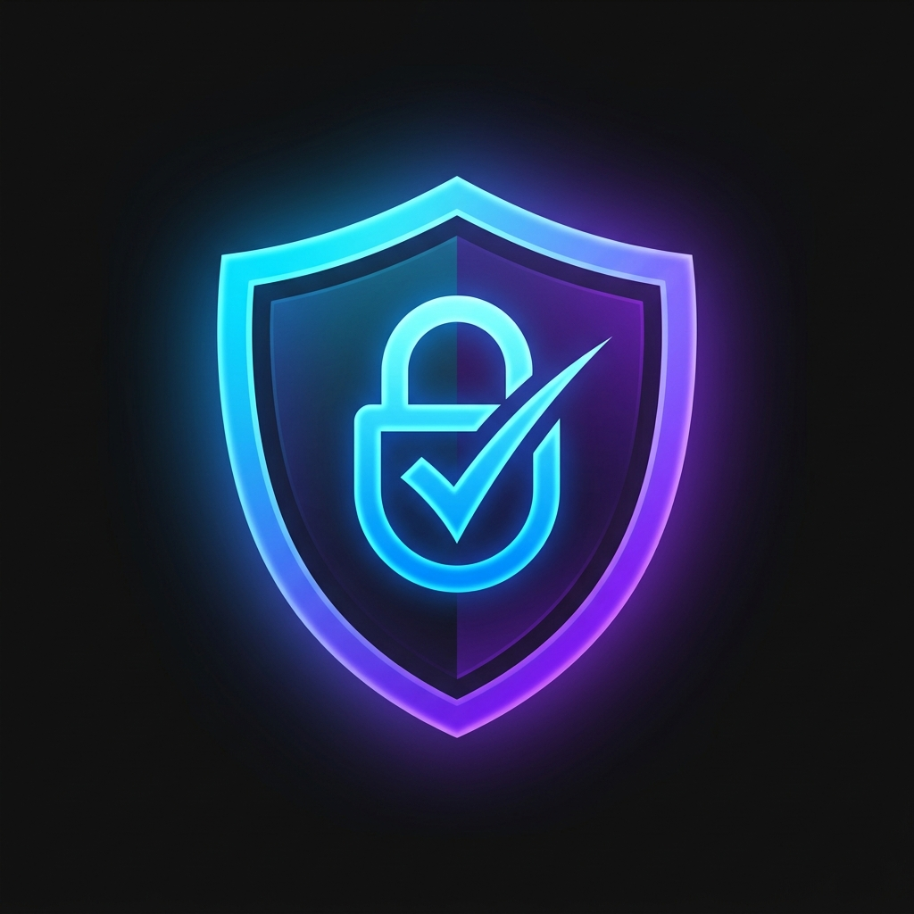

# 🛡️ PromptShield AI
### *Zero-Trust AI Protection for Generative AI*

> **Protect sensitive information before it reaches ChatGPT, Claude, Gemini, DeepSeek, and other public AI tools.**



---

## 🏆 Hackathon MVP

PromptShield AI is a production-quality, startup-grade cybersecurity SaaS product built as a Chrome Extension + Next.js Dashboard.

---

## 📁 Project Structure

```
PROMPTSHIELD AI/
├── extension/                    # Chrome Extension (Manifest V3)
│   ├── manifest.json
│   ├── background.js             # Service Worker
│   ├── content.js                # Floating indicator + prompt interception
│   ├── engine/
│   │   ├── detectionEngine.js    # 9 modular threat detectors
│   │   ├── riskEngine.js         # Risk scoring (0-100)
│   │   └── redactionEngine.js    # Smart prompt sanitization
│   ├── popup/
│   │   ├── popup.html            # 4-tab premium UI
│   │   ├── popup.css             # Glassmorphism styles
│   │   └── popup.js              # Full popup controller
│   └── assets/icons/             # Extension icons
│
├── dashboard/                    # Next.js SaaS Dashboard
│   └── src/
│       ├── app/
│       │   ├── page.tsx          # Overview
│       │   ├── analytics/        # Charts & trends
│       │   ├── threats/          # Threat log table
│       │   ├── insights/         # AI-generated insights
│       │   └── compliance/       # GDPR, SOC2, HIPAA...
│       ├── components/
│       │   ├── Sidebar.tsx
│       │   └── StatCard.tsx
│       └── lib/
│           └── store.ts          # localStorage data layer
│
├── landing/                      # Standalone Landing Page
│   ├── index.html
│   ├── style.css
│   └── main.js
│
└── README.md
```

---

## 🚀 Quick Start

### 1. Chrome Extension

```bash
# Open Chrome and navigate to:
chrome://extensions

# Enable "Developer mode" (top right toggle)
# Click "Load unpacked"
# Select the folder: PROMPTSHIELD AI/extension/
```

That's it! The extension will appear in your toolbar.

**Test it:**
1. Go to [chatgpt.com](https://chatgpt.com)
2. Type a prompt containing `sk-abc123yourkeyhere` or an email
3. The floating shield indicator will turn red
4. Click the extension icon → Scan Prompt → see results

---

### 2. Dashboard

```bash
cd dashboard
npm install
npm run dev
# Open http://localhost:3000
```

**Pages:**
- `/` — Overview with stats and recent activity
- `/analytics` — Charts and trend visualization
- `/threats` — Paginated, filterable threat log
- `/insights` — AI-generated security recommendations
- `/compliance` — GDPR, SOC2, HIPAA, PCI-DSS readiness

---

### 3. Landing Page

Simply open in a browser:
```
landing/index.html
```

---

## 🔍 Detection Engine

### Threat Detectors

| Detector | Patterns | Severity |
|----------|----------|----------|
| **APIKeyDetector** | OpenAI, AWS, GitHub, Stripe, Google, Slack, Anthropic | CRITICAL |
| **PasswordDetector** | password=, secret=, db_pass | CRITICAL |
| **PrivateKeyDetector** | PEM private keys, certificates | CRITICAL |
| **FinancialDetector** | Credit cards, Aadhaar, PAN, SSN, IBAN | HIGH |
| **URLSecretDetector** | URLs with embedded credentials | HIGH |
| **SourceCodeDetector** | Functions, classes, SQL, imports | HIGH |
| **EmailDetector** | RFC 5322 email patterns | MEDIUM |
| **PhoneDetector** | International phone numbers | MEDIUM |
| **IPAddressDetector** | Private/internal IP ranges | LOW |

### Risk Scoring

```
SAFE     (0):   No threats detected
LOW      (1-24):  Minor infrastructure data
MEDIUM   (25-49): PII - anonymize before sharing
HIGH     (50-74): Proprietary code or financial data
CRITICAL (75-100): Credentials or private keys
```

### Detection Result Format

```json
{
  "riskScore": 72,
  "riskLevel": "HIGH",
  "color": "#ff6b2b",
  "explanation": "Your prompt contains...",
  "threats": [
    {
      "type": "API Key / Secret (OpenAI API Key)",
      "category": "CREDENTIAL",
      "severity": "CRITICAL",
      "value": "sk-aBcDeFg...",
      "description": "OpenAI API Key detected...",
      "recommendation": "Remove immediately..."
    }
  ],
  "recommendations": ["...", "..."],
  "securityTips": ["...", "..."],
  "breakdown": { "critical": 1, "high": 0, "medium": 1, "low": 0 }
}
```

---

## ✨ Features

### Chrome Extension
- 🔍 **4-tab popup** — Scan, Threats, Redact, Tips
- 📊 **Animated risk gauge** — SVG gauge with smooth animation
- 🤖 **AI Security Explanation** — Typewriter-effect explanation
- ✂️ **Side-by-side diff** — Original vs sanitized prompt
- ⚡ **Fetch from tab** — Auto-load prompt from active AI tab
- 💉 **Inject to tab** — Replace prompt with sanitized version
- 🛡️ **Floating indicator** — Animated shield on AI platforms
- 📈 **Session stats** — Persistent scan history

### Dashboard
- 📊 **Overview** — 4 animated stat cards + activity feed
- 📈 **Analytics** — 4 Chart.js charts (donut, line, bar, pie)
- ⚠️ **Threat Logs** — Searchable, filterable, paginated table
- 🤖 **Insights** — 6 AI-generated recommendations
- 🔒 **Compliance** — 6 framework readiness scorecards

### Landing Page
- 🎆 **Particle animation** — WebGL-style canvas particles
- 🎯 **10 sections** — Hero, Problem, Solution, Features, How It Works, Architecture, Impact, Roadmap, Team, CTA
- 📱 **Fully responsive** — Mobile-first design
- 🎭 **Scroll animations** — Reveal on scroll with stagger

---

## 🎨 Design System

- **Theme:** Dark mode only — Deep black with electric blue + purple
- **Typography:** Inter (UI) + JetBrains Mono (code)
- **Style:** Glassmorphism + Cybersecurity aesthetic
- **Animations:** CSS keyframes + requestAnimationFrame
- **Colors:**
  - Blue: `#00d4ff`
  - Purple: `#7b2ff7`
  - Green: `#30d158`
  - Red: `#ff2d55`
  - Yellow: `#ffd60a`

---

## 🔒 Privacy

- **100% local processing** — No data sent to any server
- **No backend** — Pure client-side JavaScript
- **No authentication** — Install and use immediately
- **localStorage only** — Stats stored locally in your browser
- **No analytics** — We don't track you

---

## 🗺️ Roadmap

- [ ] **Phase 2:** Team policies & admin dashboard
- [ ] **Phase 3:** LLM-powered prompt rewriting
- [ ] **Phase 4:** REST API + Slack bot + CI/CD plugins
- [ ] **Phase 5:** Firefox extension
- [ ] **Phase 6:** Enterprise SSO + SIEM integration

---

## 🏗️ Architecture

```
User → PromptShield Extension
         ↓
    Content Script (content.js)
         ↓
    Detection Engine (detectionEngine.js)
         ↓
    Risk Engine (riskEngine.js)
         ↓
    Redaction Engine (redactionEngine.js)
         ↓
    Background Worker (background.js) → localStorage
         ↓
    Safe Prompt → AI Platform
```

---

## 📋 Compliance Coverage

| Framework | Coverage | Status |
|-----------|----------|--------|
| GDPR | PII Detection, Email/Phone Redaction | 82% Ready |
| PCI-DSS | Credit Card, CVV, Financial Data | 88% Ready |
| HIPAA | PHI Detection, Access Controls | 55% In Progress |
| SOC 2 | Threat Logging, Incident Detection | 65% In Progress |
| ISO 27001 | Risk Assessment | 40% Planning |
| NIST CSF | Identify, Protect, Detect | 70% In Progress |

---

## 👥 Built With

Built for national hackathon demonstration purposes.  
**PromptShield AI** — Secure Prompts. Safe AI. Trusted Innovation.

---

TEAM MEMBERS:
1.NANDINI KALIA
2.ANSHU CHOWDHURY

*© 2026 PromptShield AI. All rights reserved.*
